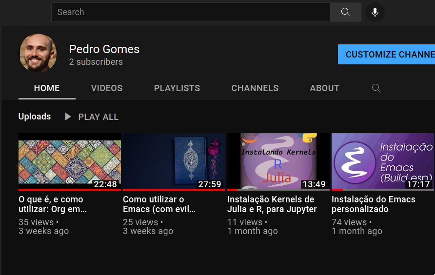

{:title "Portifolio"
 :layout :project-portifolio
 :page-index 0
 :navbar? true}

<section class="s1">

<h1>你好, Hi, Olá!</h1>

<!-- Link around dots-wrapper added after tutorial video -->
<a href="index.html">

</a>

<ul id="navigation">
<li><a href="index.html#contact">Contact</a></li>

</ul>

<h5 style="text-align: center;line-height: 0;">Personalize Theme</h5>

*Theme settings will be saved for your next vist

<h3>Expertise</h3>

Fullstack Developer, with a Degree in Physics Engineering. Linux Veteran.

<!-- 
I research at University of São Paulo and enjoy learning about a variety of subjects, including Web Design.
 -->

 <b>My resume: </b> <a target="_blank" href="https://buddhilw.com/pdf/cv-2024-11-01.pdf">Download Resume</a>

</section>

<section class="s2">

<h4>Context</h4>

I have been solving problems, and facilitating workflows, with Software, since <b>2018</b>.

The Physics Engineering Degree has been received in 2022 (enrolled in 2016). I took a year-break in university; don't ask 🫠🤣.

A meaningful amount of my work has <b>Clojure(Script)</b> in it.

Currently, I'm walking with the cool kids, writting mostly <b>Go</b>.

<!-- 
I'm in my last semester as an Undergradute in Engineering Physics and I've acquire a repertoire of skills.
 -->

<!-- 
I've worked for other Engineers, to automate report production. These Healt and Safety Engineers have worked to Lupo S.A., JBS and other major companies in Brazil. 
 -->

<!-- 
Also, I developed an automation project dealing with Clearence and Ledger, using Clojure for FlowFinance in Santa Catarina, Brazil.
 -->

 I will always be thankful to people that shaped my path, like my university supervisor, <a href=http://spherio.eel.usp.br/mediawiki/index.php/Wei-Liang_Qian"">Ph.D. Qian Wei-Liang</a>.

<h3>Find me on Youtube & Social Medias</h3>

<a target="_blank" href="https://www.youtube.com/channel/UCcDTD0VMlN2tGA7sDVZllRw">YouTube: @Branquinho</a>
 
<a target="_blank" href="https://www.facebook.com/pedro.g.branquinho/">Facebook: pedro.g.branquinho</a>
 
<a target="_blank" href="https://www.linkedin.com/in/pedro-g-branquinho/">LinkedIn: pedro-g-branquinho </a>

</section>

<section class="s2 skills">
    

        <h4 style="text-align: center;">TOP TOOLS</h4>
    

   

   <ul>
    <li>Clojure</li>
    <li>ClojureScript</li>
    <li>Go</li>
    <li>Python</li>
    <li>Julia</li>
   </ul>
   <ul>
       <li>Linux</li>
       <li>Docker/Docker Compose</li>
       <li>Kubernetes</li>
       <li>Github Actions</li>
       <li>CI/CD pipelines</li>
   </ul>
   <ul>
       <li>SAGA pattern (Cadence)</li>
       <li>HTTP1/HTTP2</li>
       <li>Kafka, GraphQL, ORM</li>
       <li>Mobile (expo)</li>
       <li>Fullstack Apps</li>
   </ul>
   

</section>

<!-- <section class="s1"> -->
<!-- 
 -->
<!-- <h3 style="text-align: center;">Some of my past projects</h3> -->

<!-- 
 -->

<!-- 
 -->
<!-- 
 -->
<!--  -->
<!-- 
 -->
<!-- <h6 class="post-title">Laboratory Management System</h6> -->
<!-- 
Designed built & mantained a the lab managment system for FOI Laboratories
 -->
<!-- <a href="/pages-output/fcc-landing/index.html">Read More</a> -->
<!-- 
 -->
<!-- 
 -->
<!-- 
 -->

<!-- 
 -->
<!-- 
 -->
<!--  -->
<!-- 
 -->
<!-- <h6 class="post-title">Online Store - CoursePost Title</h6> -->
<!-- 
Online store with paypal payments intergration and guest user shopping
 -->
<!-- <a href="post.html">Read More</a> -->
<!-- 
 -->
<!-- 
 -->
<!-- 
 -->

<!-- 
 -->
<!-- 
 -->
<!--  -->
<!-- 
 -->
<!-- <h6 class="post-title">Membership Website</h6> -->
<!-- 
Modulized guide for online courses with step by  step intructions
 -->
<!-- <a href="post.html">Read More</a> -->
<!-- 
 -->
<!-- 
 -->
<!-- 
 -->

<!-- 
 -->
<!-- 
 -->
<!-- </section> -->

<section class="s2">

<h3 style="text-align: center;">Get In Touch</h3>

<form id="contact-form" method="POST" action="mailto:pedrogbranquinho@gmail.com" enctype="text/plain">

<label>Name</label>
<input class="input-field" type="text" name="name">

<label>Subject</label>
<input class="input-field" type="text" name="subject">

<label>Email</label>
<input class="input-field" type="text" name="email">

<label>Message</label>
<textarea class="input-field" name="message"></textarea>

<input id="submit-btn" type="submit" value="Send">
</form>

</section>
