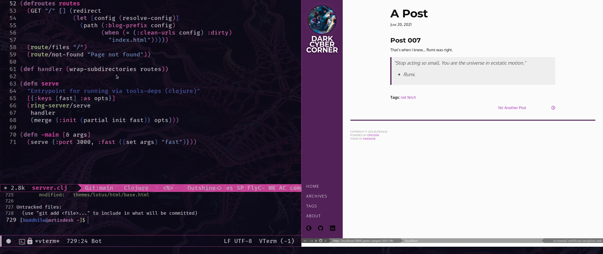

{:title "Functional Web Projects"
 :layout :post
 :tags  ["clojure" "common lisp" "extensibility" "open source"]}

### My first impressions of Cryogen and Nyxt (Clojure/Common Lisp) 

<!-- { width = 50%} -->

## --- English verion ---

In this fortnight, I worked on two side #projects.

I learned about Nyxt, a extremely extensible browser, written in pure Common Lisp. Blazely fast! I could compose him with Emacs functions easily.

At last, I develop my static website generator, based on Cryogen, a #clojure template. It's written in 70 lines of code. Pretty astonishing.  The library itself has less than 400 lines of code.

Github page: [https://github.com/BuddhiLW/Blobing](https://github.com/BuddhiLW/Blobing)

>  "Stop acting so small. You are the universe in ecstatic motion."
>  - Rumi.

## --- Portuguese version ---

Essa quinzena, tive o prazer de aprender com, e estender, dois diferentes projetos secundários. 

Utilizei a biblioteca Cryogen. Foi possível escrever um gerador de sites estáticos em 70 linhas de Clojure(Script). 

Comei a utilizar o Nyxt, um browser escrito em Common Lisp. Assustadoramente rápido. E, o mais importante, muito fácil de aprimorar seu comportamento. É possível utilizar as funções do meu editor de texto, nele, diretamente.

>  "Pare de ajir pequeninamente. Você é o universo em movimento exstático."
>- Rumi.
