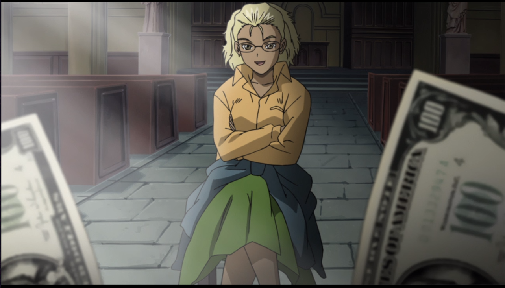
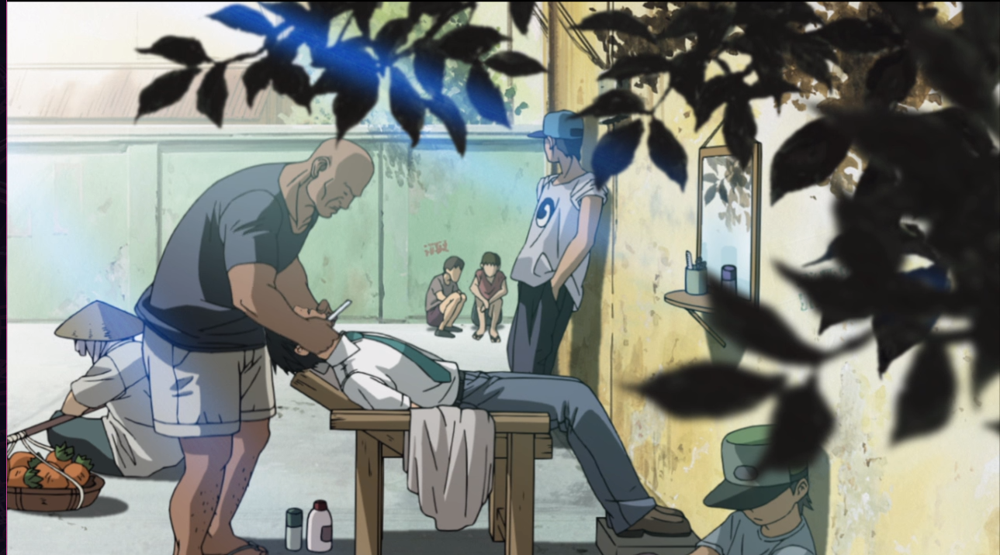
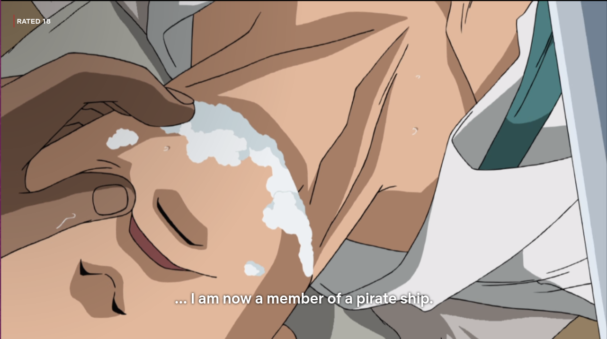
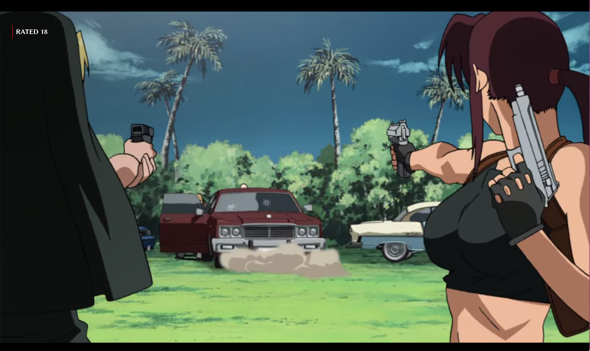

{:title "Kenneth Burke and Black Lagoon, with Org-roam."
 :layout :post
 :tags  ["Kenneth Burke""Dramatist Petand" "Org-roam" "Dramatism"]}

# Table of Contents

1.  [What is the connection between these topics?](#org46f0b8b)
    1.  [How this document is composed - Org-roam](#orgb5c8426)
    2.  [Closing the dots - Theory and Practice](#org3eaf592)
        1.  [Burke's Dramatism](#org2c1b646)
        2.  [Black Lagoon, conections between episodes S1E3 and S2E18](#org77d421c)
    3.  [The similarities and differences of Rock and Jane](#orgfdd5ced)
        1.  [Revy behavior's evolution in relation to Rock](#org87327bd)
        2.  [Differences in the situations of Jane and Rock](#org961da70)

# What is the connection between these topics?

-   **Org-roam can help us take the notes**
-   **Grammar of Motives give us background**
-   **Black Lagoon is our raw-data to analyze**

## How this document is composed - Org-roam

I will use Org-roam to write this complex document, using the
least resources.

> Everything should be made as simple as possible, but not simpler.

So, Org-roam is here to help us to connect these ideas and
publish it, in a way so not to make it harder than having the idea
and formulating it in thought and words itself.

Session's version of what he recalls from Einstein,

> It can scarcely be denied that the supreme goal of all theory is to
> make the irreducible basic elements as simple and as few as possible
> without having to surrender the adequate representation of a single
> datum of experience.

## Closing the dots - Theory and Practice

Black Lagoon is a series that can be dated to 2002; televised in
2006, by Madhouse - [Vide Black Lagoon's wikipedia](../../../../../org-roam/20210620091826-blagoon.md).

At the same time,  [Grammar of Motives](../../../../../org-roam/20210620093607-grammar_of_motives.md), by Kenneth Burke was published in 1945.

### Burke's Dramatism

Burke invented [Dramatism](../../../../../org-roam/20210620094340-dramatism.md). Through the five [Motive Agencies, ](../../../../../org-roam/20210620100909-motive_agencies.md)

-   Agent
-   Agency
-   Scene
-   Purpose
-   Act
    
    He stated, It's possible to understand the motives of an *act*.

### Black Lagoon, conections between episodes S1E3 and S2E18

1.  **Jane**

    Jane is a money-counterfeit con. She arrives at Roanapur, where she is supposed to work for a group of EUA's gangsters. The chief of this gang resides in Los Angeles, and has no idea of the scope of the island. Neither does Jane.
	 
    <!--  -->
    
    As she delays her work, and passes  two consecutive deadlines, the gangsters kill her co-worker - a computer programming expert.
    
    She knows she won't be able to finish it in time. The next day, she runs away, and wonder around Roanapur, trying to find someone which could help her.
   
		"She stands right where Rock once stood"
    
    
    She is *exactly* in the same place as has been Rock once.
   
		"Stared by the chinese woman"
    
	
		"Passes through Rock in the barber"
    
	
		"Steres the barber, scared"
    
    
	
    But, there is a fundamental difference between Rock and Jane.

2.  Rock

    Rock, on the other hand, had already passed through the turmoil. He was not on a run away. Altough, new to the city, he chose to live in it.
   
		"Rock on S01E03, on the same spot."
    
    
		"Rock accepting his fate."
    
    
		"Stares the barber, scared."
    
    
		"Stares the old woman on the street."
    
    
   Roanapur Show's it self inhospitable to both characters. But, they face it differently. At one hand, Rock had never been a dishonest person. Actually, he used to work on a white-collar business, with no action in his life. Only unconsciously, he desired a dynamic, challenging, criminal life. Which he shows, when decides to stay on the island. He has nothing to gain or lose, monetarily; the meaning he finds is to improve the state of the affairs on the place, and work for Lagoon Company.
    
	"S01EP03, Rock bring groceries to Lagoon Company, after shave."
    

## The similarities and differences of Rock and Jane

On the other hand, Jane is scared for her life's worth. And, she plans to go away as soon as she can. Thus, the inhospitably of the island escalates drastically. This is materialized, when she heads to Revy and the Rip-Off Church - she finds herself on the middle ground of a cross-fire. Rock, oppositely, was calming down at this same hour, taking his groceries to Lagoon company.

### Revy behavior's evolution in relation to Rock

	"Revy on the Church, dialogue with Eda - Eda to Revy."

	"Revy complains about Rock - much more lightly than on EP03."

She gradually is becoming more accustomed to Rock. Instead of implying he doesn't belong there, or that his time is intrinsically flawed, and won't survive, she points out something superficial about him, his clothes - as if now he is just annoying.

### Differences in the situations of Jane and Rock

1.  Rock &#x2013; Agent vs Scene

    As we analyze the Scene, in S02E18, Rock is part of it. And, Jane is the Agent. The behavior and world-view of Revy has structurally fit the scenery. Finally, Jane is the Agent of this new chapter.
    
    Once, Rock was the Agent, and thus the quality of the Scene changed in regards to him, more strongly.

2.  Acts and Agency, effects on the Scene

    As Jane is using money, and power (her Agency), under a lot of stress and rush, the Scene-Act takes shape accordingly. The villains chase her to the Church, and, in a inordinate manner, tries to capture her. If he was calmer, as if he listened to a secondary character trying to calm him down. Then, the equilibrium state wouldn't be bothered. And, he'd have achieved easily his goal of capturing Jane. 
    
	"Cross-fire on the Rip-Off Church"
    

3.  Conclusions on the Motive

    We note all other character, as the Chief Gangster, in the degree they are related to Jane, this Scenery takes the quality of her-self (Agent), her Act, and her Purpose of leaving the Island and rip-offing gangsters; finally, her violent Agency.
    
    Thus, all motive can be understood properly. There will be unnecessary complexity to each task, a lot of tension and buying off one-another. Indeed, that sums up the rest of the episode. The motive being, escaping Roanapur at all costs.
    
	"Jane explain her Act."
    
    
	"Gangster paying off hitmen."
    
    
	"Jane Pay off the Rip-Off Church."
    
    
	"Jane's escape war."
    

