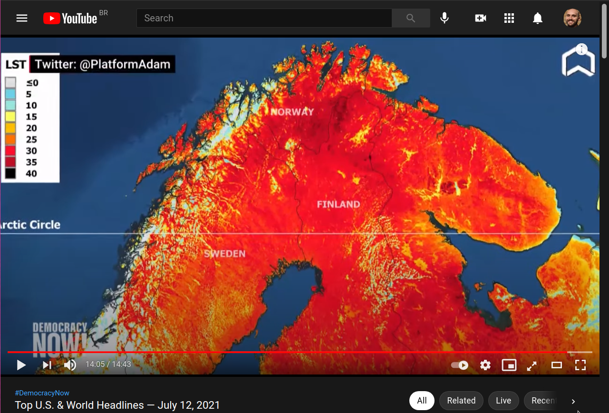
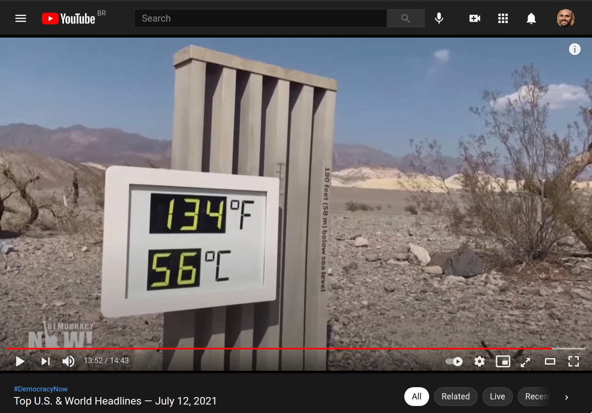

{:title "Global Warming (GW) 2021: 35C Norway."
 :layout :post
 :tags  ["ecology", "global warming", "gw", "norway", "science", "climate"]}

# Table of Contents

1.  [Norway is hotter than US, California this year.](#org554648f)
    1.  [I used to say, six years ago,](#org95768d7)
    2.  [Wait until there is no food at the shelves.](#orgb38b06b)
    3.  [I have a great idea, alright?](#org89ef9f6)

# Norway is hotter than US, California this year.

<!--  -->

	"Norway 35C"

 

## I used to say, six years ago,

We had ten years to act - according to some estimates [1]. Folks and gals used to laugh at me, and say I was crazy. Well, that's what apocalyptic conditions looks like; and it's just the beginning. We are at ~1.5C average increase of climate [2]. At 2C, we are all doomed, being very gentle with the wording. Best predictions say we will very hopefully stop at 3C [3]. 

## Wait until there is no food at the shelves.

Yeah, soon you will be obliged to stop eating meat, also. I mean IF you don't want to die of ecocide.

## I have a great idea, alright?

Screw business and politics and let's give social-economical power to scientists whose forecasts are always above 95% precision level. Just stating the obvious. By the way, they offer actionable plans, different from politicians [4].

<!--  -->
	
	"US record temperature all history."

 

[1]: Peters, Glen P., et al. "The challenge to keep global warming below 2 C." Nature Climate Change 3.1 (2013): 4-6.
[2]:<https://www.carbonbrief.org/state-of-the-climate-how-the-world-warmed-in-2019>
[3]:<https://www.theguardian.com/environment/2021/jun/23/climate-change-dangerous-thresholds-un-report>
[4]:<https://www.nature.com/articles/s41467-021-22884-9>

