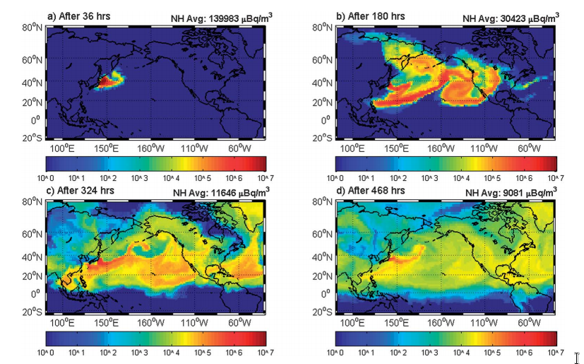

{:title "Functional Web Projects"
 :layout :post
 :tags  ["biology" "climate change" "bio-cc" "climate lag" "collapse" ""]}

# Table of Contents

1.  [Climate-lag (BIO-CC)](#org16dfb1d)
    1.  [Fukushima](#org8322061)
    2.  [Preferential futures:](#orgaf634ea)

# Climate-lag (BIO-CC)

Most species's life cycle are, at most, of [30 years](https://tpwd.texas.gov/publications/nonpwdpubs/young_naturalist/animals/animal_life_spans/). When populations
go extinct, because of global change. It happens "all of a
sudden". Because one year you had them; the next, less than half; in 5
years, none - their offspring didn't survive, so the cycle collapses.

That's one of the whys some climate-crises-conditions only appear
10-30 year later (the so-called climate-lag)[1],[2].

## Fukushima

Fukushima, for example, consequences are still being studied. From
what we know, anyone who eats fish monthly, has "digested" radioative
food [3] (photo). Not enough, they decided to release the Fukushima
water they treated, saying it's safe to drink it - just as many have
said, let the politicians who say that take the first sip [4].

\*Image from Stanford's simulation paper (Worldwide health effects of the Fukushima Daiichi nuclear accident, John E. Ten Hoevea and Mark Z. Jacobson, 2012)

## Preferential futures:

-   Remedy of biological collapses.
-   Sustainable industrialization of underdevelopment countries.
-   Share state-of-the-art technologies.

[1]: <https://iopscience.iop.org/article/10.1088/1748-9326/9/12/124002/pdf>
[2]: <https://climate.nasa.gov/effects/>
[3]: <https://web.stanford.edu/group/efmh/jacobson/TenHoeveEES12.pdf>
[4]: <https://www.reuters.com/business/environment/countries-react-japans-plans-release-fukushima-water-into-ocean-2021-04-13/>

