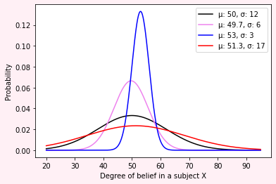

{:title "Noise-Signal ratios (F-tests)"
 :layout :post
 :tags  ["science" ""]}

# 2021 Agust 07, How to classify Groups scientifically (F-tests)

Let's imagine we have four normaly-distributed groups with different
'intrisic' variability in regards to belief on a X-subject.

## We can use scipy, numpy and matplotlib to help us through our thoughts

    from scipy.stats import norm
    import numpy as np
    import matplotlib.pyplot as plt

##  Visualizing these many distributions

        #x-axis
        x = np.arange(20, 95, 0.001)
        
        ## background
        plt.figure(facecolor='#FFF0F5')
        
        ###define normal values (not normalized)
        plt.plot(x, norm.pdf(x, 50, 12), label='μ: 50, σ: 12', color='k')
        plt.plot(x, norm.pdf(x, 49.7, 6), label='μ: 49.7, σ: 6', color='violet')
        plt.plot(x, norm.pdf(x, 53, 3), label='μ: 53, σ: 3', color='blue')
        plt.plot(x, norm.pdf(x, 51.3, 17), label='μ: 51.3, σ: 17', color='red')
        
        # Axis titles
        plt.xlabel('Degree of belief in a subject X')
        plt.ylabel('Probability')
        #add legend to plot
        plt.legend()
        
        plt.show()
 
 

Ok, we see these are all close to one another. At the same time,
some groups are more orthodox, as blue, which means they posses extremely narrow
possible views about this subject X.

So, the question is, can we categorize them as one thing (holding the same belief), without committing overgeneralization?

##  The Hypothesis

###  S1: Hypothesis undirectional ANOVA

Can we measure the behavior of these four groups as the same, without loss of generality?
    
The Null and Alternative Hypothesis follow,
    
$$H_0: \hat{\mu_1}=\hat{\mu_2}=\hat{\mu_3}=\hat{\mu_4}$$
$$H_1: \hat{\mu_i}\neq \hat{\mu_j},\quad i\neq{}j$$
    
That is, either they can or can not be treated as the same. 

###  The Analysis Of Variance (ANOVA) method is perfectly suited for that

We will have a more in-depth knowledge of the origins and  the
mathematical basis of ANOVA's in other posts.
    
Let's dive in solving our mystery first. Just an overview:
		
	- ANOVA will compare differences of means using standard variations
			- There are the *Within* measures of groups.
			- There are the *Between* measures of groups.
		
		- Generally, if we wanted to compare directly among two groups, we would use:
			- T-tests
			- Z-tests
    
###  Why use it instead of T-tests and Z-tests
    
By using the **Variations** as our way of comparison, we can abstract
the fact we are dealing with n-groups an concentrate in a
one-dimensional variable.
        
If we were to deal with means to derive these conclusions, we couldn't
take that approach. We rather would have to make six T-tests:
        
$$\quad \binom{\textrm{n-groups}}{2}= \frac{n!}{2!(n-2)!}$$
$$\implies n=4:\quad  \binom{\textrm{4}}{2}= \frac{4!}{2!(4-2)!}=6$$
    
###  What does it measure, exactly?
    
Our final measure we'll be look at is the F-ratio: $$F=\dfrac{S_{Between}}{S_{Within}}$$
        
The **Variation** inside groups can be estimated by 	
$$S_{Within}$$.
			
The **Variation** among different groups can be estimated by
$$S_{Between}$$.
        
But, the Between estimator also that the Within variation as a
baseline. So, truly, it can be seen as \\(S_{Between}=S_{Within}+
S_{\textrm{Intrinsic variation among groups}}\\)
        
Thus, F is a ratio to measure how much of \\(S_{\textrm{Intrinsic variation
among groups}}\\) account for differences among individuals of each
groups.

###  Finally, computation

Now that we had an overview of what we need to compute an ANOVA and
how it work, let's do the Math.
    
1.  *A priori* threshold for certainty
    
In Statistics, we can choose levels of causality and certainties we
are prepared to accept as truth. Here, we will adopt the
\\(\alpha=0.05\\). That is, I want to be "95% sure" that this relation is Causal.  
    
###  Degrees of freedom
    
An abstract concept we use to compute are degrees of freedom. In this
case we have 4 groups and  - let's arbitrarily say we took 4 people and
measured them in each group. So,
        
$$df_{between}=(n_{\textrm{groups}}-1)=34$$	
$$df_{within}=(n_{\textrm{measures}}-n_{\textrm{groups}})=12$$
        
##  Our cutoff
        
Looking at a table, \\(F_{3,12}=2.60552\\).
            
This is our cutoff.
    
###  Variations and F
    
Generally, we have.

$$S^2_M=$$
		
$$\dfrac{\sum\limits_i (M_i-GM)^2}{df_{\textrm{between}}}$$

        
$$S_{Within}=$$
			
The average of
		
$$\sum\limits_{i=1} S_i^2$$
		
		
$$F=$$
$$\dfrac{S_{\textrm{Between}}}{S_{\textrm{Within}}}$$
		
$$S_{Between}=$$
$$\sqrt{n.{S^{2}}_{M}}$$
        
	n: quantity of people measured per group
	N: quantity of groups
	GM: mean of means
        
Thus,
        
$$GM = \frac{50+49.7+53+51.3}{4}=51$$

$$\quad S_{Within} = \dfrac{12+6+3+17}{4}=9.5$$
		
$$S_M^2=2.26$$
		
$$\quad S_{\textrm{Between}} = \sqrt{4\times{}2.26}=9.04$$
        
Finally, \\(F=\dfrac{9.04}{9.5}=0.952\\).
    
###  Comparison with a table and cutoff
    
As \\( F=0.952 \\) measured is way less than \\(F_{\{(3, 12),
\alpha=0.05\}}=2.60552\\).  
		
We conclude that we shouldn't negate the null hypothesis
(\\(H_0\\)).
        
In this case, we could say all these four groups could be
treated as the same (average-wise).
        
Do you agree? Well, ether you do or not, that's scientific
scrutiny, right there.
