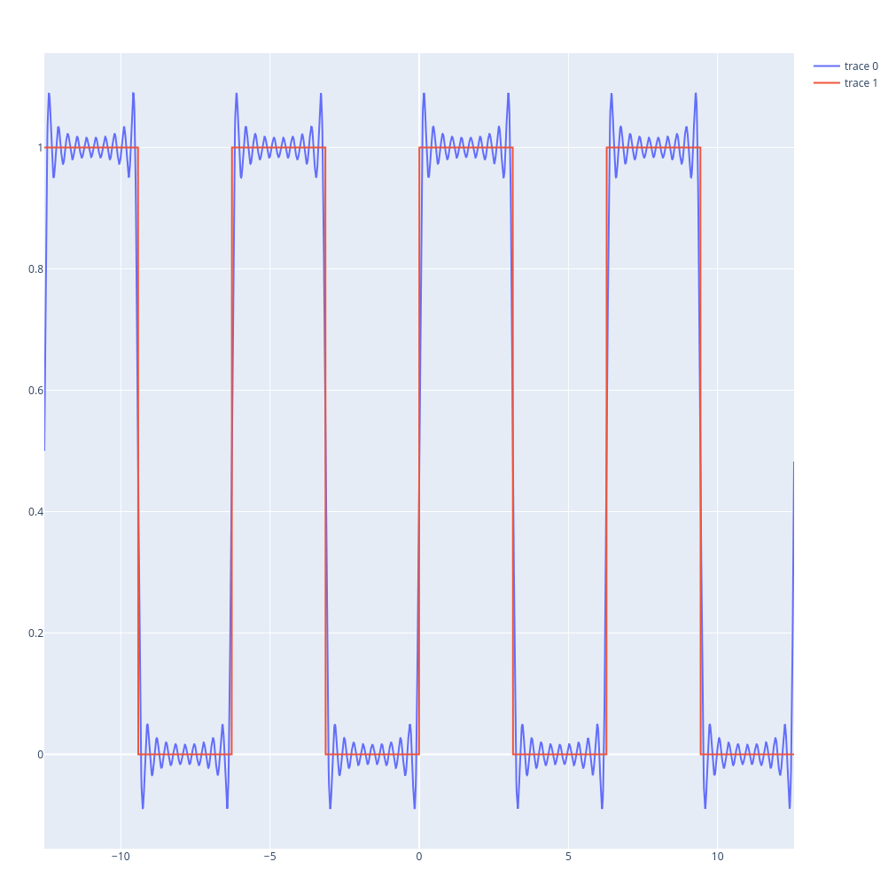
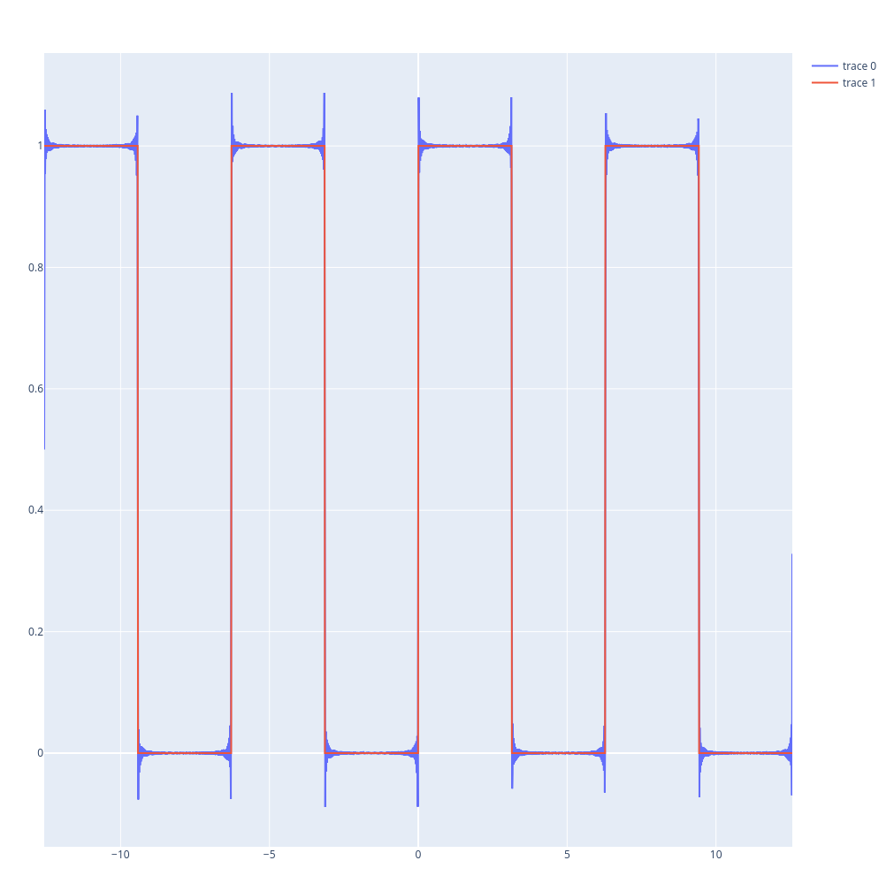

{:title "Fourier Series, An Example"
 :layout :post
 :tags  ["julia" "modeling" "analysis" "science" "fourier" "series" "fourier series" "periodic" "inequality"]}

# Table of Contents

1.  [Plot de uma série de Fourier](#org92968c8)
    1.  [Função à descrever](#orgaa53458)
    2.  [Solução analítica](#orgbb90a0c)
    3.  [Implementação em Julia](#org18d9e9b)
    4.  [Plot](#orgd89c0a2)


<a id="org92968c8"></a>

# Plot de uma série de Fourier


<a id="orgaa53458"></a>

## Função à descrever

```latex
\begin{equation}
\begin{aligned}
f(x) =
\begin{cases}
1, \quad 0\leq\text{x}<\pi\\
0, \quad -\pi\leq\text{x}<0\\
\end{cases}\\
\text{periodic with period T}=2\pi
\end{aligned}
\end{equation}
```
\begin\{equation\}
\begin\{aligned\}
f(x) =
\begin\{cases\}
1, \quad 0\leq\text\{x\}<\pi\\\\
0, \quad -\pi\leq\text\{x\}<0\\\\
\end\{cases\}\\\\
\text\{periodic with period T\}=2\pi
\end\{aligned\}
\end\{equation\}

<a id="orgbb90a0c"></a>

## Solução analítica

Usando,

\begin\{equation\}
\begin\{aligned\}
f(x) = \dfrac\{1\}\{2\}a\_0 + \sum\_\{n=1\}^\infty \left[a\_n \cos(\dfrac\{n \pi x\}\{L\}) + b_n \sin(\dfrac\{n \pi x\}\{L\})\right]
\end\{aligned\}
\end\{equation\}

Chegamos em,

\begin\{equation\}
\begin\{aligned\}
\begin\{cases\}
a_0 &= 1\\\\
a_n &= 0, \quad \forall n \in \mathbb\{K\}\\\\
b_k &= \dfrac\{2\}\{(2k-1)\pi\}
\end\{cases\}
\end\{aligned\}
\end\{equation\}

O que significa que

\begin\{equation\}
\begin\{aligned\}
f(x) = \frac\{1\}\{2\} + \sum_\{k=1\}^\{\infty\}\{\left(\dfrac\{2\}\{(2k-1)\pi\}\sin\{((2k-1)x)\}\right)\}
\end\{aligned\}
\end\{equation\}


<a id="org18d9e9b"></a>

## Implementação em Julia

A função aproximação da série de **Fourier**

    function f(x,N)
      g = 1/2
      for k in 1:1:N
          g += (2/((2*k -1)*π))*sin((2*k-1)*x)
      end
      return g
    end

Mapeamos os valores para o intervalo que queremos estimar a função periódica

    values = map(x -> f.(-4*π:0.01:4*π,x), 1:1:100)

Por fim, definimos a função real, a qual queremos aproximar

    function f_actual(x)
        if abs(x)<π
    	if 0<=x<π 
    	    return 1
    	elseif -π<=x<0
    	    return 0
    	end
        else 
    	y = (x/2π -floor(x/2π))*2π
    	if π<=y<2π 
    	    return 0
    	elseif 0<=y<π
    	    return 1
    	end
        end
    end

Gerando os valores literais

    values_actual = f_actual.(-4*π:0.01:4*π)


<a id="orgd89c0a2"></a>

## Plot
Usaremos a biblioteca *PlotlyJS.jl*, para gerarmos um gráfico de alta qualidade,

    trace = PlotlyJS.scatter(;x=xs, y=values[10])

    trace2 = PlotlyJS.scatter(;x=xs, y=values[100])

    trace3 = PlotlyJS.scatter(;x=xs, y=values_actual)


    PlotlyJS.plot([trace,trace3])
	
Fourier com 10 termos de aproximação
[](ein-images/fourier.png)

    PlotlyJS.plot([trace2,trace3])

Fourier com 100 termos de aproximação
[](ein-images/fourier2.png)

