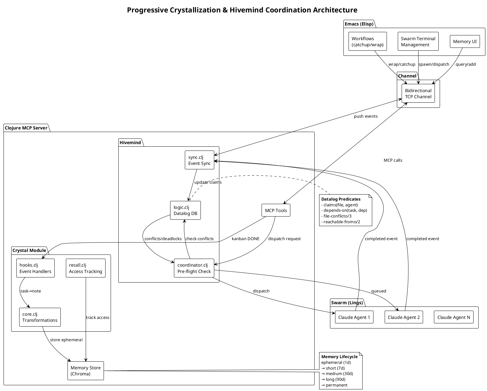
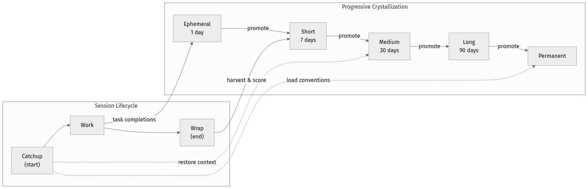
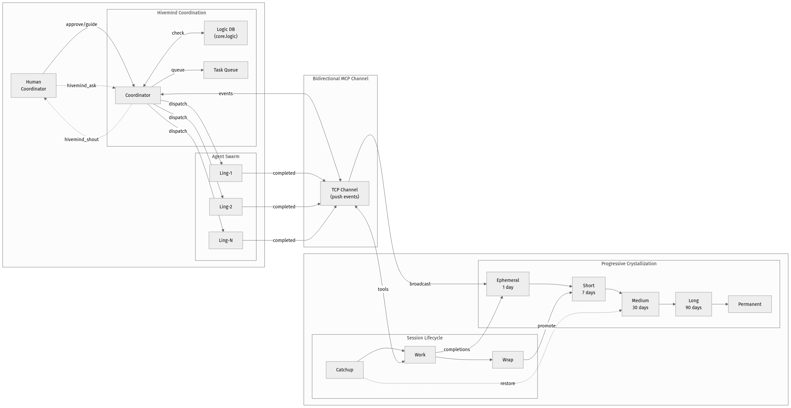
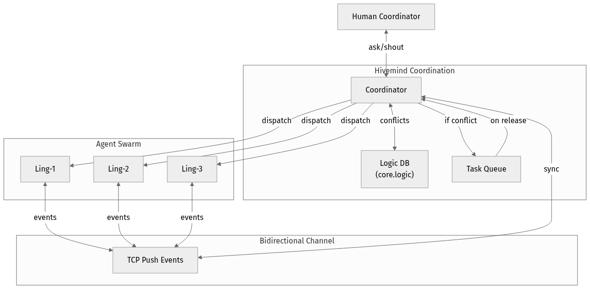
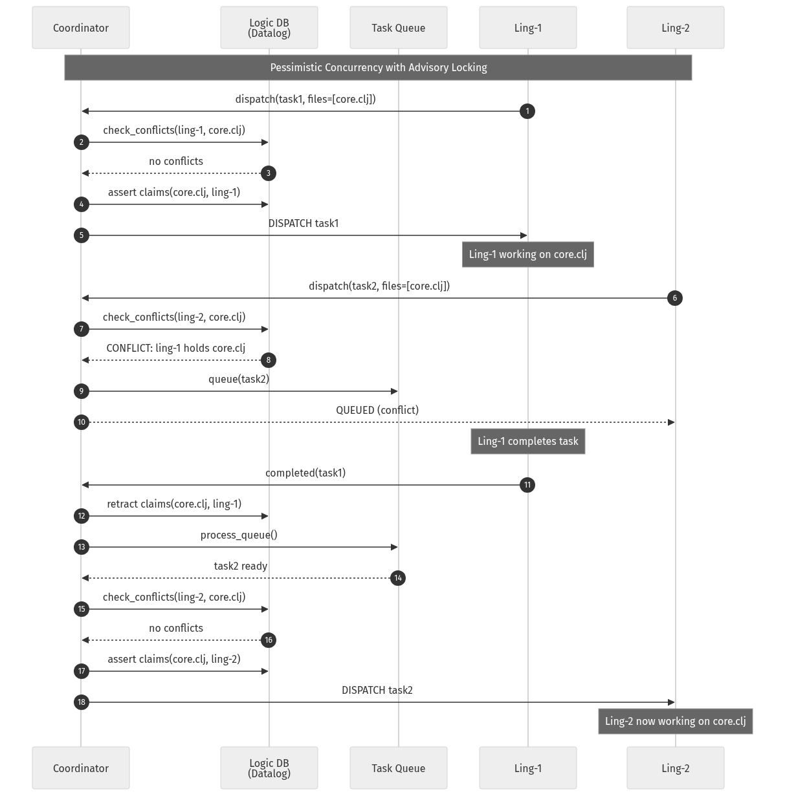
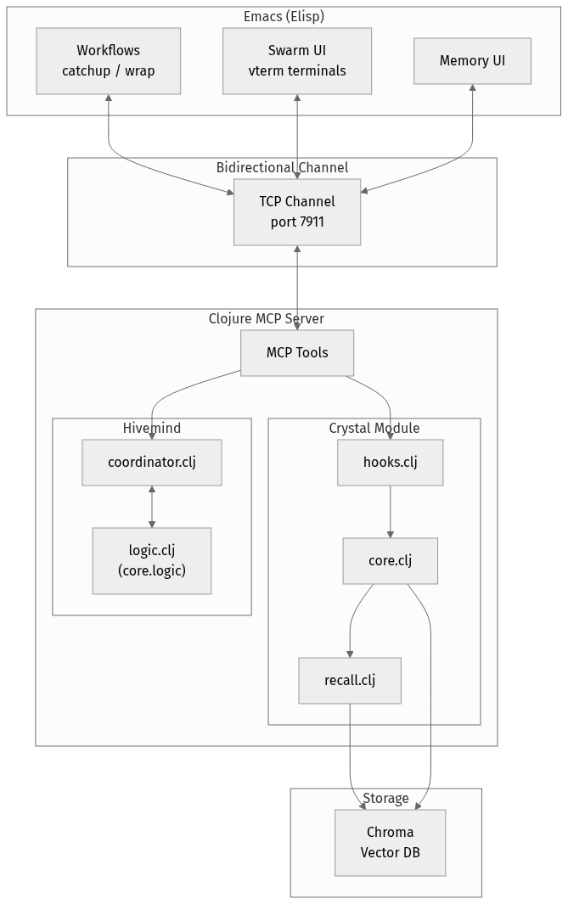
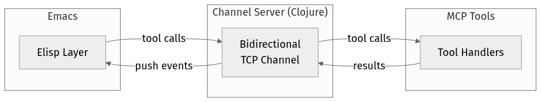

{:title "8-10x Faster Development with LLM Memory That Persists"
 :layout :post
 :tags  ["llm" "mcp" "emacs" "clojure" "ai" "agents" "open-source" "multi-agent" "continuous-learning"]}

We built a memory and coordination system for LLM coding assistants that achieved **8-10x speedup** on real development tasks with **50-70% cost reduction**.

The architecture: LLMs that don't just retrieve memory—they *author* it. Structured, persistent, project-scoped memory with lifecycle management. No fine-tuning, no massive system prompts.

This post explains how it works. The patterns are tool-agnostic. The implementation (Emacs + Clojure) is open-source.

**The problem it solves**: Every time you start a new Claude session, it forgets everything. Your coding conventions, architectural decisions, that bug you spent hours debugging yesterday—gone. You re-explain context, re-establish patterns, and watch tokens burn on repetition.

**What if your LLM could learn your project over time?**

Not through fine-tuning. Through *memory*—structured, persistent, project-scoped memory that the LLM both reads and writes via MCP.

<a id="the-problem"></a>
## The Problem

LLM coding assistants face two fundamental constraints:

1. **Memory**: Context windows are finite, but development sessions accumulate unbounded observations
2. **Concurrency**: Multiple agents working in parallel inevitably conflict on shared files

Current approaches address these independently. RAG systems treat all memories equally regardless of recency or access patterns. Multi-agent frameworks rely on conversation orchestration rather than resource coordination.

We propose two architectures that synergize:

- **Progressive Crystallization**: Memories follow a lifecycle from ephemeral observations through session summaries to permanent project knowledge
- **Hivemind Coordination**: Agents claim files before editing using advisory locks; conflicts queue (not block) while `core.logic` reasons about dependencies and deadlocks

### How This Differs from Existing Tools

*These tools serve different primary goals. Cursor/Aider/Continue optimize for single-session productivity. Hive-MCP optimizes for multi-session learning and parallel coordination. Direct comparison is imperfect.*

| Feature | Cursor | Aider | Continue | Copilot | Hive-MCP |
|---------|--------|-------|----------|---------|----------|
| Cross-session memory | Chat history | None | None | None | Tiered crystallization (5 levels) |
| LLM writes to memory | No | No | No | No | **Yes** |
| Memory lifecycle (TTL) | No | No | No | No | Yes (auto-expiry + promotion) |
| Multi-agent coordination | No | No | No | No | Advisory locks + queue |
| Parallel workers | No | No | No | No | Lings + drones |

The key differentiator: **the LLM authors its own memories**. Other tools give the LLM read access to context. Hive-MCP gives it write access to a structured memory system with lifecycle management.



<a id="from-memory-to-learning"></a>
## From Memory to Learning

Here's the key insight: **the LLM doesn't just retrieve memories - it authors them.**

```
Session 1: Claude learns your error handling → creates memory
Session 2: Recalls convention, discovers auth pattern → creates memory
Session 3: Finds edge case in JWT refresh → creates memory
...
Session N: Claude knows your project like a teammate who's been there for months
```

Each session, the LLM:
1. **Loads context** via `/catchup` (decisions, conventions, recent work)
2. **Works with accumulated knowledge** (applies learned patterns)
3. **Discovers new patterns** (notices things while implementing)
4. **Crystallizes learnings** via `/wrap` (saves for future sessions)

This is **continuous learning without fine-tuning**. No gradient updates, no LoRA, no retraining. Just structured memory that compounds over time.

The difference from RAG:
- **RAG**: Static retrieval over your documentation
- **Crystallization**: Living memory that evolves as your project evolves

Your AI assistant becomes a *learning* assistant. It notices that you always handle errors a certain way. It remembers that one microservice has a quirky API. It knows which tests are flaky. Knowledge accumulates.

### The Pattern (Tool-Agnostic)

If you're building similar systems, here's the minimal architecture:

**Required components:**
1. **Memory store** with duration/TTL (not just a vector DB dump)
2. **Session hooks** (start → load context, end → harvest learnings)
3. **LLM write access** to memory (not just read!)
4. **Promotion logic** (what's worth keeping?)

**Optional but powerful:**
5. **Project scoping** (memories belong to projects, not global soup)
6. **Semantic search** (find relevant context even without exact keywords)
7. **Multi-agent coordination** (if you want parallel workers)

The rest of this post details our implementation. But the pattern above is the core insight.

<a id="progressive-crystallization"></a>
## Progressive Crystallization (Our Implementation)

Rather than binary retention, memories follow a lifecycle inspired by human memory consolidation:

| Duration | TTL | Examples |
|----------|-----|----------|
| Ephemeral | 1 day | Debugging notes, intermediate findings |
| Short-term | 7 days | Kanban tasks, session summaries |
| Medium-term | 30 days | Decisions, discovered patterns |
| Long-term | 90 days | Architectural insights |
| Permanent | Never | Core conventions |



### The Rhythm

Three workflows drive the lifecycle:

**Catchup** (session start): Retrieves active decisions, expiring memories, in-progress tasks. Primes the agent with relevant context without loading entire history.

```
/catchup → loads 5 priority conventions, recent decisions, git status
```

**Task completion hooks**: When kanban tasks move to "done," crystal hooks automatically create ephemeral progress notes capturing the summary.

**Wrap** (session end): Harvests ephemeral notes, scores by access patterns and helpfulness feedback, promotes high-value entries to longer durations.

```
/wrap → wrap_crystallize() → wrap_notify event → coordinator permeates
```

This creates a natural rhythm: *work generates ephemeral observations → wrap crystallizes valuable ones → catchup restores context*.



<a id="hivemind-coordination"></a>
## Multi-Agent Coordination (The Second Problem)

Memory solves learning. But what about **parallelism**?

Multiple agents editing the same file = corruption. Traditional solutions use mutexes that block. We use **advisory locking with queue-based conflicts**.



### How It Works

1. Agent requests to edit `/src/core.clj`
2. Coordinator checks claims via `core.logic` predicates
3. If unclaimed: grant claim, proceed
4. If claimed by another: queue task, notify when cleared

```clojure
;; Datalog-style conflict detection
(logic/check-file-conflicts "new-agent" ["/src/core.clj"])
;; => [{:file "/src/core.clj" :held-by "other-agent"}]
```

### Why core.logic?

Clojure's `core.logic` (a Prolog-style constraint solver) enables declarative queries that would be awkward imperatively:

- **Transitive closure**: "Is file X reachable through any dependency chain?"
- **Negation-as-failure**: "Is this file claimed by SOMEONE ELSE?"
- **Deadlock detection**: "Would adding this dependency create a cycle?"



<a id="the-token-hierarchy"></a>
## The Token Hierarchy

Not all work needs expensive tokens. Hive-MCP uses a tiered architecture:

```
Coordinator (Claude Opus) ─── Strategic decisions, spawning, memory curation
    │
    └── Lings (Claude instances) ─── Task supervision, drone orchestration
            │
            └── Drones (OpenRouter free-tier) ─── File mutations, grunt work
```

**Coordinator**: Plans and delegates. Never reads large files or does implementation.

**Lings**: Spawned Claude instances that supervise tasks. They dispatch work to drones.

**Drones**: Free-tier models (via OpenRouter) that do the actual file edits. Cheap, disposable, validated.

### Solving JVM Bloat with bb-mcp

A naive implementation would spawn one JVM per ling (~500MB each). With 15 lings, that's 7.5GB just for JVM overhead.

**[bb-mcp](https://github.com/BuddhiLW/bb-mcp)** solves this: a Babashka wrapper (~50MB) that connects multiple lings to a single shared hive-mcp JVM via nREPL.

| Architecture | 15 lings | Memory |
|--------------|----------|--------|
| Direct JVM | 15 × 500MB | ~7.5GB |
| bb-mcp | 1 × 500MB + 15 × 50MB | ~1.25GB |

On a 30GB machine, this means 15+ concurrent lings with 20GB+ headroom remaining - enough for the actual work (builds, tests, language servers).

### Self-Healing Validation

For Clojure projects, `dispatch_validated_wave` runs `clj-kondo` after each drone edit. If linting fails, it auto-generates fix tasks and re-dispatches until clean:

```
drone edits file → kondo finds error → generate fix task → drone fixes → kondo passes
```

<a id="implementation"></a>
## Implementation



The system is ~15k lines across:

- **Clojure backend**: Functional, REPL-driven development
- **DataScript**: Datomic-style immutable DB for entity persistence
- **core.logic**: Declarative constraint queries for coordination
- **Chroma + Ollama**: Vector DB with local embeddings for semantic search
- **MCP protocol**: Claude ↔ Emacs communication
- **WebSocket channel**: Real-time events (hivemind_shout, wrap_notify)

### Bidirectional Channel (The Hidden Problem)

MCP is call-response like HTTP—LLM calls, server responds. But coordination needs push notifications: when a ling finishes `/wrap`, the coordinator needs to know *without polling*.

**Our solution**: Event piggybacking. Pending events attach to any MCP response:

```
LLM calls: mcp_memory_query(...)

Server responds:
{
  "result": { ... },           // normal response
  "hivemind": [                // piggybacked events!
    {"agent": "ling-42", "event": "wrap_notify", "msg": "Session wrapped"}
  ]
}
```

The coordinator sees `wrap_notify` on its next tool call—no polling, no token burn.



### Why Emacs + Clojure?

Both support **live reloading**—modify code while the system runs. No restart, no lost state. This enabled rapid self-hosting: once the Elisp↔Clojure bridge stabilized, every subsequent feature was built by Claude using hive-mcp itself. The tool's memory contains decisions about how to build the tool.

### Measured Results

*Methodology: Self-measured across 47 development sessions over 8 weeks, single developer, M2 MacBook Pro 32GB. Tasks ranged from bug fixes (~30min solo equivalent) to multi-file refactors (~3hrs solo equivalent) to new feature implementations. "Solo Claude" baseline = Claude Code CLI with manual context management. Caveat: dogfooding bias—we built the tool, so treat multipliers as directional, not precise.*

| Metric | Solo Claude | With Hive-MCP | Observed Range |
|--------|-------------|---------------|----------------|
| Context continuity | Manual re-explanation | `/catchup` restores | 1.5-2x less re-explaining |
| Parallel throughput | Sequential tasks | Concurrent lings | 2-4x on independent work |
| Token cost | Opus for everything | Drones handle grunt work | 50-70% reduction |

**Case study**: GraphStore implementation (protocol + DataScript backend + 600 LOC tests)
- Solo estimate: 4-6 hours (based on similar past tasks)
- Swarm (6 lings): 28 minutes wall-clock
- Cost: $0.83 (logged via OpenRouter dashboard)
- Speedup: ~8x (ceiling limited by task dependencies)

**Honest friction**: Drone reliability remains uneven. Free-tier models hallucinate; the self-healing loop catches most errors but adds 20-30% overhead on complex edits. Not magic—just better than baseline.

The real unlock isn't just speed—it's *sustainable* speed. Solo Claude burns context. Hive-MCP lets you work on a project for weeks without re-explaining everything.

<a id="try-it"></a>
## Try It

### If You Use Emacs

**Repository**: [github.com/BuddhiLW/hive-mcp](https://github.com/BuddhiLW/hive-mcp)

**Requirements**:
- Emacs 28.1+
- Clojure CLI 1.11+
- Java 17+
- Optional: Ollama (semantic search), Claude Code CLI

```bash
git clone https://github.com/BuddhiLW/hive-mcp
cd hive-mcp
./start-mcp.sh
```

### If You Don't Use Emacs

The architecture is the real contribution. Three paths forward:

**1. Port the patterns** (most valuable)
The core insight—LLM-authored memory with lifecycle tiers—works in any stack:
- **Memory**: Any vector DB with TTL support (Chroma, Pinecone, Postgres+pgvector)
- **Session hooks**: Pre/post hooks in your editor extension or CLI wrapper
- **Coordination**: Datalog (DataScript), SQLite with recursive CTEs, or Redis advisory locks

**2. Study the reference** (quickest learning)
- [bb-mcp](https://github.com/BuddhiLW/bb-mcp): 800-line Babashka thin-client showing the MCP↔JVM bridge pattern
- [mcp-clojure-sdk](https://github.com/unravel-team/mcp-clojure-sdk): Protocol implementation, no Anthropic lock-in

**3. Contribute**
VSCode and JetBrains ports would be welcome. The MCP layer is editor-agnostic. Open an issue if interested.

### Limitations

- **Claude Code CLI**: Currently tied to Claude Code as the agent interface. The MCP layer itself uses [mcp-clojure-sdk](https://github.com/unravel-team/mcp-clojure-sdk) (protocol-compliant, not Anthropic-specific), so other MCP-compatible clients could work-but untested
- **Emacs-centric**: Deep integration means Emacs dependency. VSCode/JetBrains would require significant porting
- **Drone reliability**: Free-tier models (OpenRouter) are inconsistent. The self-healing loop helps, but friction remains
- **Memory curation**: Manual review/promotion still needed. Automated quality scoring is TODO
- **Single-machine**: No distributed coordination (yet). Multiple developers need separate instances

---

## Why Open Source?

The crystallization patterns work on our codebase. We want them stress-tested on codebases unlike ours. If the memory lifecycle breaks on your 200-service monorepo, or the conflict queue deadlocks under load—we want those bug reports. Battle-testing requires battle.

*Hive-MCP is under active development. The kanban has 90+ items. Contributions welcome.*

---

## The Bigger Picture

Fine-tuning is expensive, slow, and often overkill. RAG is static-it retrieves, but doesn't learn.

Memory is the middle path. Your LLM accumulates expertise session by session, project by project. It learns your conventions, remembers your decisions, knows your codebase's quirks.

**From amnesia to expertise. No gradient updates required.**

